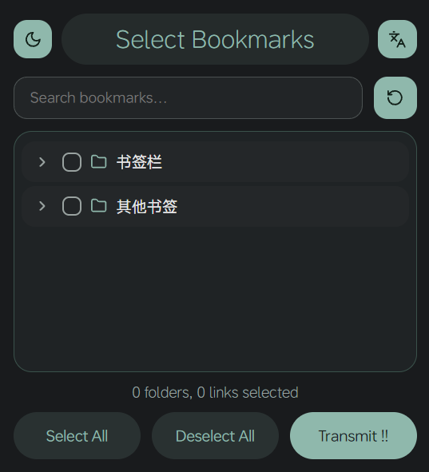
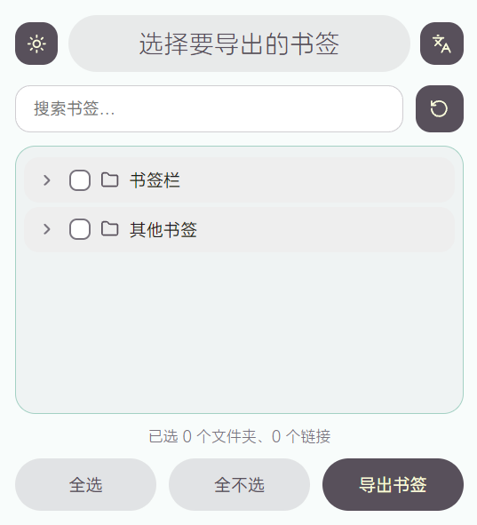

<div align="center">

  
  
  <p>
    <a href="README.md">简体中文</a> | 
    <a href="README_EN.md">English</a>
  </p>
  
  <h1>BookmarksPortal</h1>
  <h2>Export Your Bookmarks to JSON File</h2>
  
  <p>BookmarksPortal is a powerful browser extension that accompanies the ChuwuBookmarks Project.</p>
  <p>Supported ExtensionManifestV3.</p>
  <p>Want to download? Click: <a href="https://github.com/ChuwuYo/BookmarksPortal/releases/latest">Download</a></p>
  
</div>

## Features

- Export browser bookmarks as JSON files (with a companion structure.json index file)
- Chinese/English interface with persistent language choice
- Bookmark tree search, tri-state checkbox cascading, remember last selection
- Supports Chrome and Firefox browsers (single codebase build)
- Dark mode support, lightweight and fast

## Screenshots

<div style="display: flex; justify-content: space-between; margin-top: 20px;">
    
    
</div>

## Development

Single source of truth lives in `src/`, built into per-browser artifacts:

```bash
npm install        # Install dev dependencies
npm run build      # Build dist/chrome and dist/firefox
npm test           # Run export-format contract tests
npm run lint       # ESLint
npm run format     # Prettier
npm run pack       # Pack both browser zips into dist/artifacts (with SHA256)
npm run verify     # Full verification chain (same as CI)
```

Load in browser: Chrome `chrome://extensions` with Developer mode -> select `dist/chrome`; Firefox `about:debugging` -> select `dist/firefox/manifest.json`.

## Release

Pushes to main automatically publish a rolling prerelease (tag `latest`); pushing a `v*` tag (must match the manifest version) publishes a formal release with both Chrome and Firefox packages plus a SHA256 checksum file.